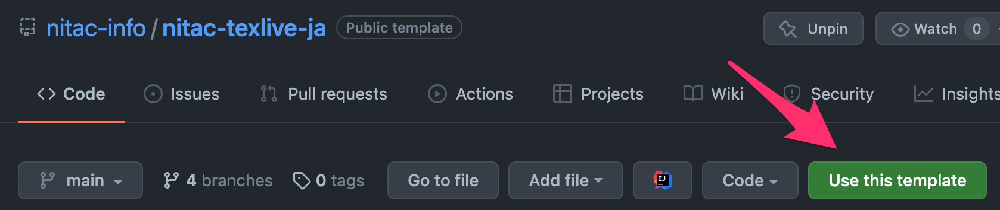
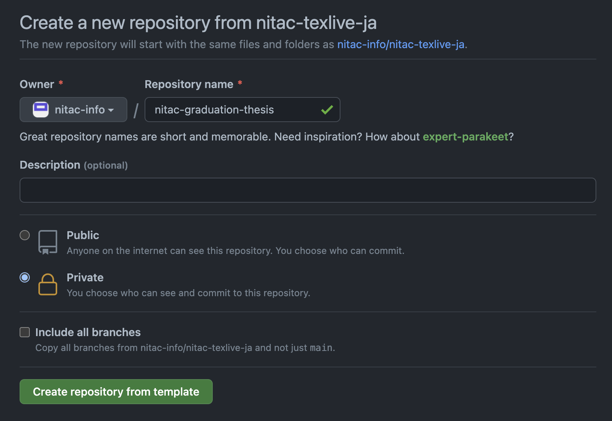

# nitac-graduation-thesis-template

阿南工業高等専門学校 情報コース 卒業論文 の LaTeX テンプレートリポジトリです．<br>
[電気情報通信学会和文論文誌](https://www.ieice.org/jpn/shiori/cs_2.html) の LaTeX テンプレートをもとに作成しています．

# フォルダ構造

```
├── README.md (本ファイル)
├── draft (卒論ドラフトテンプレートフォルダ)
│   ├── ipsjcommon.sty
│   ├── ipsjdrafts.sty
│   ├── ipsjpapers.cls
│   ├── ipsjpapers.sty
│   └── nitac-drafts.tex
├── latexmkrc
├── paper (卒業論文テンプレートフォルダ)
│   ├── ieicej.cls
│   ├── nitac-paper.tex
│   └── sieicej.bst
└── scripts
    ├── texc.ps1 (Windows 環境用コンパイルスクリプト)
    └── texc.sh  (Mac・Linux 環境用コンパイルスクリプト)
```

# 使い方

## 1. テンプレートからリポジトリを作成

### 1.1. Use this template をクリックする



### 1.2. リポジトリ名を設定する

卒業論文なので private リポジトリがおすすめです．



## 2. 作成したリポジトリをクローン

ユーザー名・リポジトリ名は各自置き換えてください．<br>
例では以下になっています．

- ユーザー名
  - nitac-info
- リポジトリ名
  - nitac-graduation-thesis

```sh
git clone https://github.com/nitac-info/nitac-graduation-thesis
```

## 3. LaTeX ファイルのコンパイル

`/scripts` 内に @Aluminum-Fairy が作成したスクリプトもあります

### ドラフト

#### Windows(PowerShell)

```sh
cd nitac-graduation-thesis/drafts
docker run --rm -it -v ${PWD}:/workdir ghcr.io/nitac-info/nitac-texlive-ja:latest \
    sh -c 'latexmk -C nitac-drafts.tex && latexmk nitac-drafts.tex && latexmk -c nitac-drafts.tex'
```

#### Mac・Linux

```sh
cd nitac-graduation-thesis/drafts
docker run --rm -it -v $PWD:/workdir ghcr.io/nitac-info/nitac-texlive-ja:latest \
    sh -c 'latexmk -C nitac-drafts.tex && latexmk nitac-drafts.tex && latexmk -c nitac-drafts.tex'
```

### 論文

#### Windows(PowerShell)

```sh
cd nitac-graduation-thesis/paper
docker run --rm -it -v ${PWD}:/workdir ghcr.io/nitac-info/nitac-texlive-ja:latest \
    sh -c 'latexmk -C nitac-paper.tex && latexmk nitac-paper.tex && latexmk -c nitac-paper.tex'
```

#### Mac・Linux

```sh
cd nitac-graduation-thesis/paper
docker run --rm -it -v $PWD:/workdir ghcr.io/nitac-info/nitac-texlive-ja:latest \
    sh -c 'latexmk -C nitac-paper.tex && latexmk nitac-paper.tex && latexmk -c nitac-paper.tex'
```

# その他

## Visual Studio Code + LaTeX Workshop で自動コンパイルを行う

1. [LaTeX Workshop](https://marketplace.visualstudio.com/items?itemName=James-Yu.latex-workshop) をインストールする
2. Visual Studio Code の `settings.json` に以下を追加する ([開き方](https://code.visualstudio.com/docs/getstarted/settings))
3. 論文作成フォルダ(`/paper`，`/drafts`)に `latexmkrc` ファイルをコピーする
   1. 忘れてビルドしてしまった場合はコマンドパレットから `LaTeX Workshop: Kill LaTeX compiler process` を実行する．

```json
{
  "latex-workshop.docker.enabled": true,
  "latex-workshop.docker.image.latex": "ghcr.io/nitac-info/nitac-texlive-ja:latest",
  "latex-workshop.latex.autoClean.run": "onBuilt",
  "latex-workshop.latex.clean.fileTypes": [
    "*.aux",
    "*.bbl",
    "*.blg",
    "*.idx",
    "*.ind",
    "*.lof",
    "*.lot",
    "*.out",
    "*.toc",
    "*.acn",
    "*.acr",
    "*.alg",
    "*.glg",
    "*.glo",
    "*.gls",
    "*.ist",
    "*.fls",
    "*.log",
    "*.fdb_latexmk",
    "*.snm",
    "*.nav",
    "*.dvi",
    "*.synctex.gz"
  ],
  "latex-workshop.latex.recipes": [
    {
      "name": "compile",
      "tools": ["latexmk"]
    }
  ],
  "latex-workshop.latex.tools": [
    {
      "args": ["-gg", "%DOCFILE%"],
      "command": "latexmk",
      "name": "latexmk"
    }
  ]
}
```

## docker イメージをカスタマイズする

`\SI[]{}` が使える `siunitx` を入れたい場合

```dockerfile
FROM ghcr.io/nitac-info/nitac-texlive-ja:latest

RUN tlmgr install siunitx
```

```sh
docker build -t ghcr.io/nitac-info/nitac-texlive-ja:custom .
```

ビルド後にVisual Studio Codeでコンパイルする場合は `settings.json` の `latex-workshop.docker.image.latex` を書き換える